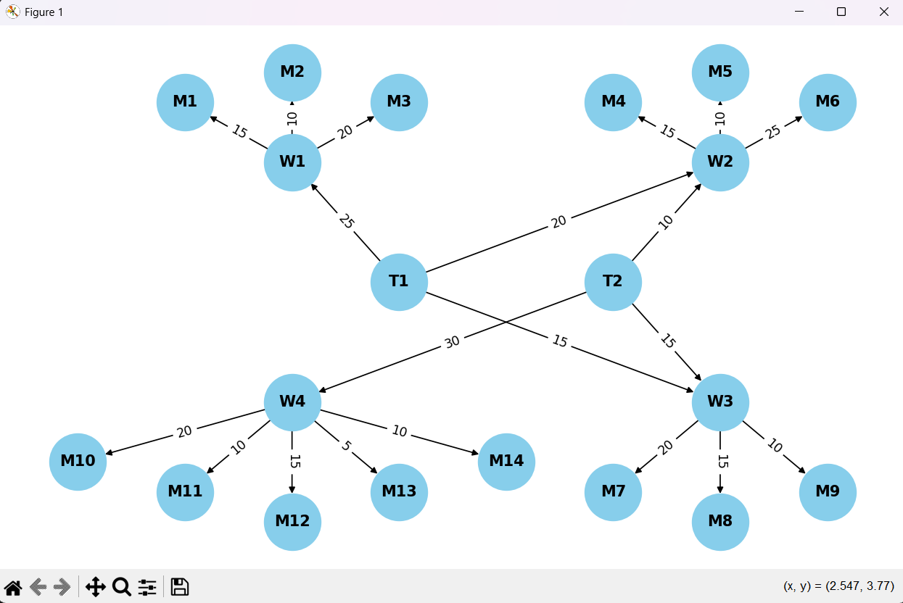

## Результати алгоритму максимального потоку

Глобальний максимальний потік: **115**

## Розподіл потоків між терміналами та магазинами

| Термінал | Магазин | Потік |
|----------|---------|-------|
| T1       | M1      | 15    |
| T1       | M2      | 10    |
| T1       | M3      | 0     |
| T1       | M4      | 10    |
| T1       | M5      | 7     |
| T1       | M6      | 3     |
| T1       | M7      | 10    |
| T1       | M8      | 5     |
| T1       | M9      | 0     |
| T2       | M4      | 5     |
| T2       | M5      | 3     |
| T2       | M6      | 2     |
| T2       | M7      | 10    |
| T2       | M8      | 5     |
| T2       | M9      | 0     |
| T2       | M10     | 20    |
| T2       | M11     | 10    |
| T2       | M12     | 0     |
| T2       | M13     | 0     |
| T2       | M14     | 0     |

### 1. Які термінали забезпечують найбільший потік товарів до магазинів?
**T1 забезпечує найбільший потік** — 60 одиниць, порівняно з 55 одиницями у T2.

---

### 2. Які маршрути мають найменшу пропускну здатність і як це впливає?
**Найменшу пропускну здатність мають:**
- Склад 4 → Магазин 13: 5 одиниць  
- Склад 4 → Магазин 14: 10 одиниць  
- Склад 3 → Магазин 9: 10 одиниць  
- Склад 1 → Магазин 2: 10 одиниць  

**Вплив:**  
Ці маршрути обмежують можливість доставки до відповідних магазинів.  
Магазини **M13, M14, M9, M2** отримали **0 одиниць**, що свідчить про вузькі місця або конкуренцію за ресурси.

---

### 3. Які магазини отримали найменше товарів і чи можна збільшити їх постачання?
**Магазини з найменшим постачанням:**
- M3, M9, M12, M13, M14

**Можливі дії:**
- Збільшити пропускну здатність маршрутів до цих магазинів  
- Перерозподілити потік з менш завантажених маршрутів

---

### 4. Чи є вузькі місця, які можна усунути?
**Не використані маршрути:**
- Склад 4 → M13 (5 одиниць)  
- Склад 4 → M14 (10 одиниць)  
- Склад 3 → M9 (10 одиниць)  
- Склад 1 → M3 (20 одиниць)  

**Усунення:**
- Збільшити пропускну здатність цих маршрутів  
- Перевірити можливість перенаправлення потоку через менш завантажені склади  
- Оптимізувати маршрутизацію з урахуванням реального попиту 
